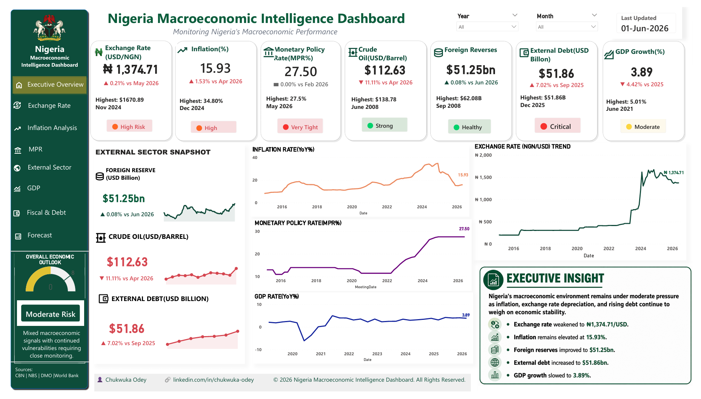
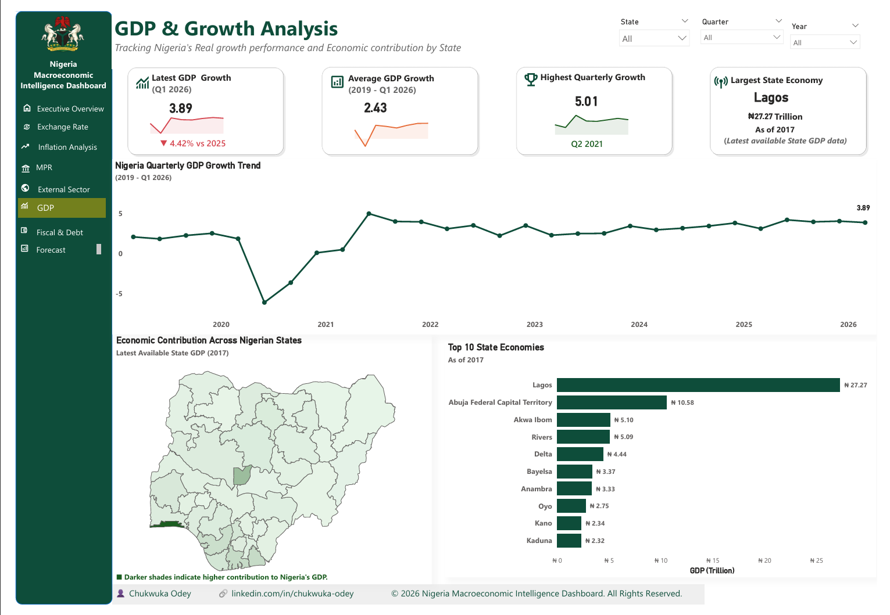
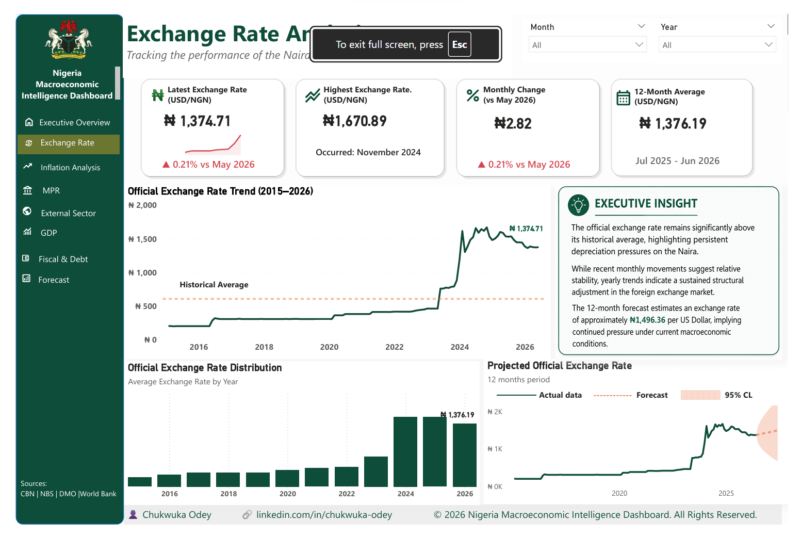
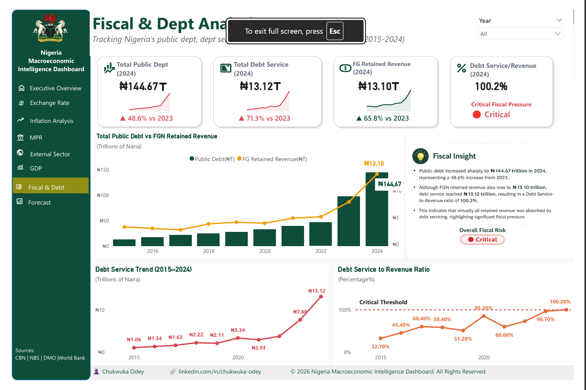
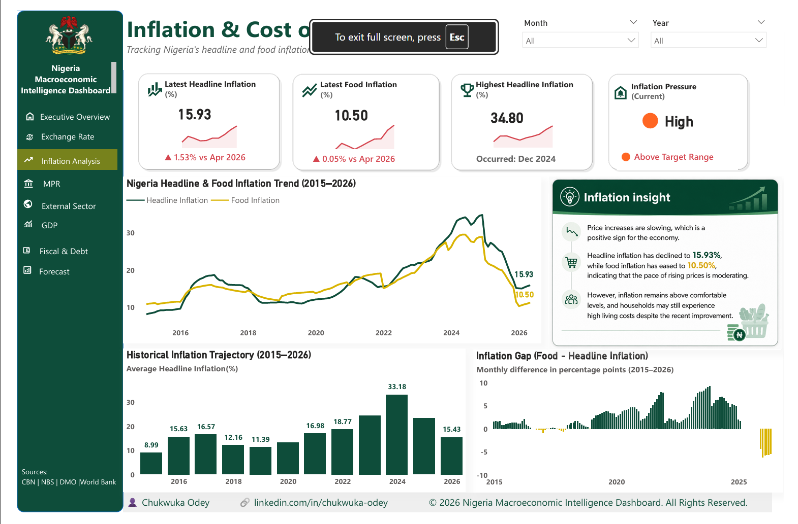

# Nigeria Macroeconomic Intelligence Dashboard

An interactive Power BI dashboard tracking Nigeria's macroeconomic performance, including GDP, inflation, exchange rates, fiscal debt, and external sector metrics.

**Author:** Chukwuka Odey
**Data Sources:** CBN | NBS | DMO | World Bank

## 📊 Dashboard Preview

### 1. Executive Overview

*Key insights: Exchange rate weakened to ₦1,374.71/USD, Inflation at 15.93%, External debt at $51.86bn.*

### 2. GDP & Growth Analysis

*Tracking real GDP growth (3.89% in Q1 2026) and state-level economic contribution.*

### 3. Exchange Rate Analysis

*Historical trend (2015-2026) and 12-month forecast for the Naira.*

### 4. Fiscal & Debt Analysis

*Public debt reached ₦144.67T in 2024, with a Debt Service-to-Revenue ratio of 100.2%.*

### 5. Inflation & Cost of Living

*Headline inflation at 15.93%, food inflation at 10.50%.*

## 🛠️ Tech Stack
*   **Power BI:** Data modeling, DAX, Data Visualization
*   **Excel:** Data cleaning and preliminary analysis
*   **Data Sources:** CBN, NBS, DMO, World Bank

## 🚀 How to Use
1. Download the `.pbix` file from the `dashboard/` folder.
2. Open in Power BI Desktop.
3. Explore the interactive filters and reports.